# Retirement Planner — User Guide

A walkthrough of everyday use, plus the yearly-update checklist that keeps the model honest. All screenshots show the app's generic example plan, not anyone's real numbers.

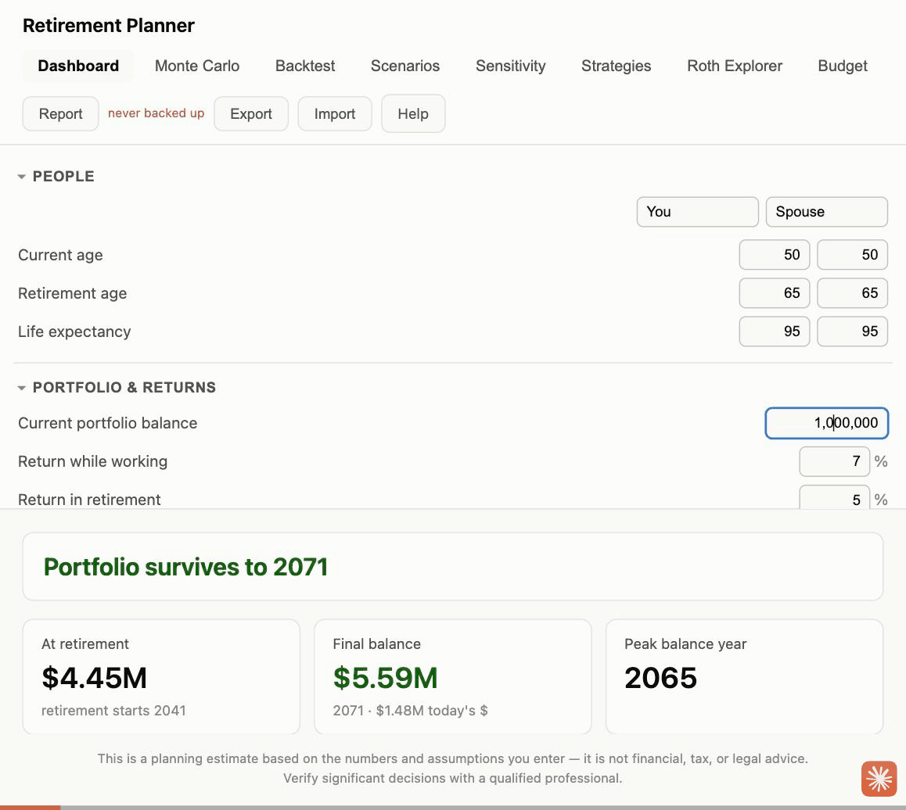

---

## Quick start — your plan in 10 minutes

The app opens with example numbers. Replace them with yours, top to bottom in the left panel — nothing you type ever leaves your browser:

1. **People** — your ages, the ages you want to retire, and life expectancy (be generous; running out at 90 because you planned to 85 is the failure that matters). Type your names in the two boxes so the columns are labeled for you — **left is always you, right is your spouse**. **No spouse?** Set *Planning for* to **Just me** at the top of this section — the spouse columns disappear, and in detailed tax mode the plan correctly uses single-filer brackets, deduction, and IRMAA tiers.
2. **Portfolio & returns** — your total invested savings today. Leave the return and inflation assumptions alone for now; the defaults are reasonable.
3. **Retirement spending phases** — set the Go-Go annual spending: what a year of your life costs, in today's dollars, *excluding* health insurance (the app models that separately). This is the number the whole plan is most sensitive to. If you're not sure, that's what the Budget tab is for — but a rough number gets you started.
4. **Health insurance & Medicare** — if you'll retire before 65, set the pre-Medicare premium to what a family plan costs (this surprises everyone; it's often $20K+ a year).
5. **Social Security** — put in the benefit estimates from your latest statement at [ssa.gov](https://www.ssa.gov/myaccount/) and the ages you plan to claim.
6. **Read the verdict** at the top of the Dashboard: *survives* or *runs out in 20XX*. Hover the charts below it to see any year of your plan.
7. **Check the Monte Carlo tab.** If the Dashboard says "survives" but Monte Carlo says 60%, your plan works only if markets behave — keep reading at §4.
8. **Click Export** in the header and keep the file. That's your backup.

That's a working plan. Everything else — the spending step-downs by age, events like inheritances or weddings, the detailed tax model, Roth conversions — is refinement, covered below.

### Already retired? Start here instead

The steps above are written for someone still working and saving. If you're already retired, the app works just as well, but the order — and what you enter — is different:

1. **People** — set each retirement age **at or below your current age**. That's what switches the plan straight into withdrawal mode: contributions are ignored automatically, and the "at retirement" stat tile shows "—" since that's behind you.
2. **Portfolio & returns** — your total balance today, right now, not a future projection.
3. **Retirement spending phases** — this is your *actual current* spending, not an estimate of something years away. Set Go-Go annual spending to what you really spend now, and check which phase (Go-Go / Slow-Go / No-Go) matches your age — you may already be in the second or third one.
4. **Health insurance & Medicare** — if either of you is 65+, this section is mostly about Medicare Part B/D premiums, which the app already assumes; if either of you is under 65, set the pre-Medicare premium to what you're actually paying.
5. **Social Security** — if you're already claiming, enter **this year's actual benefit** (from your SSA statement or bank deposit) with your **real, past claim age** — not an estimate for a future age. The claiming-age comparison on the Strategies page (§4) is only useful for benefits you haven't started yet.
6. **Read the verdict**, then go straight to **Strategies** and **Monte Carlo / Backtest** (§4) rather than Sensitivity's "earliest retirement age" solver, which doesn't apply to you. Withdrawal strategy (fixed vs. guardrails) and sequence-of-returns risk are live concerns when you're actively drawing down, not distant what-ifs.
7. **Export** a backup once your numbers are in.

Skipping the **Contributions** section is fine — it only affects money going in, and you're not adding any. If you switch to detailed mode for the sharper tax modeling, just enter your real current account balances in the three buckets (taxable / traditional / Roth) and move on.

---

## 1. Starting the app

Double-click **Start Retirement Planner.command** in the project folder. A Terminal window opens (that's the server — leave it open, minimize it), and your browser opens `https://localhost:5173` a moment later. Close the Terminal window when you're done.

First-time setup only: install the local HTTPS certificate so Safari trusts the app (see the README's "Run it" section — `brew install mkcert`, `mkcert -install`, generate the certs).

**Always use the same address.** Your data is stored by the browser *per address*, so `https://localhost:5173` is where it lives. A different port or plain `http://` shows an empty app — the data isn't gone, it's under the other address.

## 2. Your data: saving, backups, and the Report

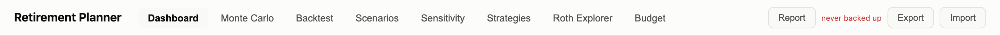

Everything autosaves to the browser as you type — there is no Save button. The header gives you three tools:

- **Export** downloads a JSON snapshot of everything (inputs, budget, scenarios). This is your backup. The note next to it shows how long it's been — it turns red after 30 days, because browsers *can* wipe local storage (clearing website data, resetting a profile). Export monthly and keep the file somewhere safe.
- **Import** restores an exported file. Use it to load your plan on first run, recover from a wipe, or move to another browser.
- **Report** opens a one-page printable summary — verdict, assumptions, outcome stats (including Monte Carlo and historical success), charts, and the full year table. Click *Print / Save as PDF* and use the browser's print dialog. Good for an annual paper record or for discussing with an advisor.

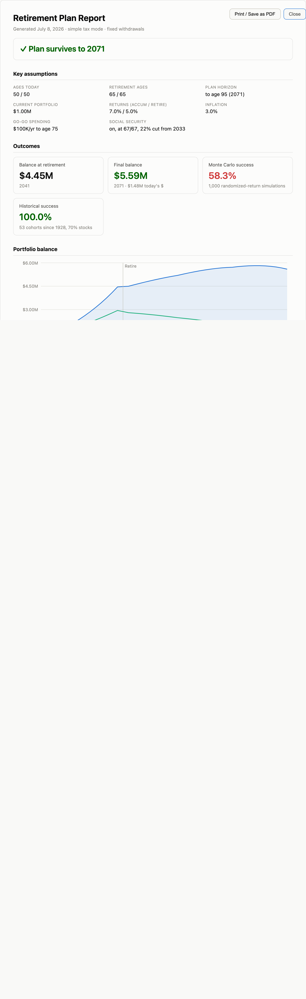

**Where your data actually lives.** Nothing you type is ever sent anywhere — there's no server, no account, no network request carrying your numbers. Everything is saved by the browser to a small file on your own disk (technically a local database, in the browser's profile folder), the same way a document saved to your Desktop lives on disk. That means it has whatever protection your device already has — your login password, full-disk encryption if it's turned on — and nothing more or less. Only this app's own page can read it through the browser (other websites you visit can't reach it), but anyone with access to your logged-in account, or malware running on it, has the same access to it as to any other file you own.

Practically: on your own personal computer or phone, this is no different from any other saved file, and the normal (non-private) browsing you're already using is correct — it's what lets the app remember your plan between visits. If you're ever using this on a computer other people also log into (a shared family computer, a library machine), a **private/incognito browsing window** is worth using instead — it keeps the data from persisting on that shared device after you close the window. The tradeoff: private windows don't save anything between visits at all, so you'd need to **Export** before closing and **Import** again next time, rather than relying on autosave.

## 3. Entering your plan

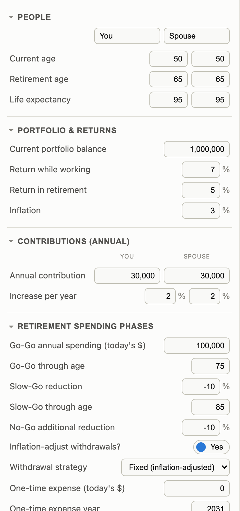

The left panel drives everything; every page recalculates instantly as you type. Where a row has two boxes, the **left column is you, the right is your spouse** (the YOU / SPOUSE labels pick up the names you set at the top).

Section notes:

- **People** — ages, retirement ages, life expectancy. The plan runs to *your* life expectancy.
- **Portfolio & returns** — in simple tax mode you enter one balance; in detailed mode the balance is the sum of the account buckets (see §5).
- **Retirement spending phases** — annual spending in today's dollars, stepping down through Go-Go / Slow-Go / No-Go ages. The withdrawal strategy selector (fixed vs. guardrails) also lives here.
- **Income & expense events** — pensions, rental income, inheritance, part-time work, one-off or multi-year expenses, each with its own years and inflation setting.
- **Health insurance & Medicare** — the pre-Medicare family premium (the big early-retirement cost), then per-person Part B/D once each of you reaches 65.
- **Social Security** — per-person start ages and benefits, optional COLA, and a funding-cut haircut if you want to assume Congress lets the trust fund run short.
- **Stress test / Long-term care / Cash reserve / Survivor** — optional what-ifs, all off by default except as your plan needs them.

## 4. The pages — which one answers your question?

| Your question | Go to |
| --- | --- |
| "Does our plan work at all? Where does the money go each year?" | **Dashboard** |
| "How much can we safely spend? How early could we retire?" | **Sensitivity** |
| "How likely is the plan to survive if markets don't cooperate?" | **Monte Carlo** and **Backtest** together |
| "What if we retire two years earlier / buy the lake house / help with college?" | **Scenarios** (plus an event in the inputs panel) |
| "Should we cut spending in bad markets? When should we claim Social Security?" | **Strategies** |
| "Should we convert IRA money to Roth, and how much?" | **Roth Explorer** |
| "What do we actually spend, and does the plan reflect it?" | **Budget** |
| "Are we ahead or behind compared to last year?" | **Scenarios** (yearly checkup, §6) |

### Dashboard
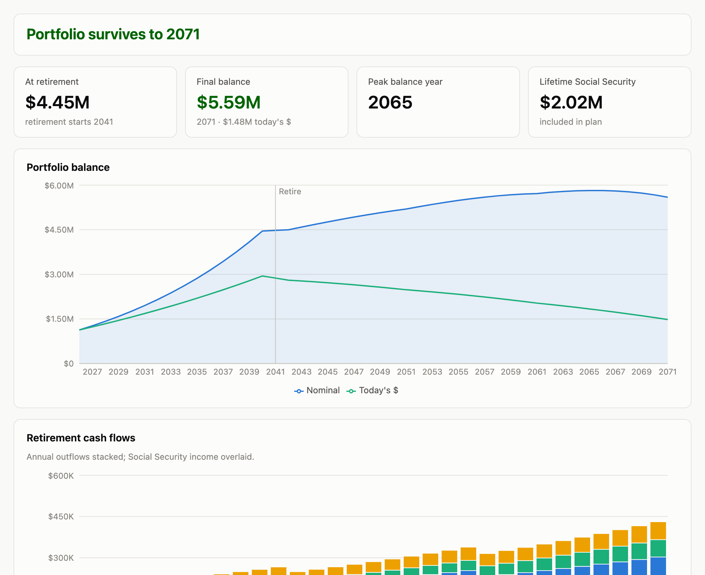

Your home base: the verdict ("survives" or "runs out in 20XX"), headline stats, balance charts (nominal and today's dollars), the retirement cash-flow chart, and the full year-by-year table. **Use it** whenever you change an input — everything recalculates live, so this is where you develop a feel for what matters.

One caution: the Dashboard is a single projection using your exact return assumptions, so it's the *most optimistic* view. A green verdict here is necessary but not sufficient — check the two risk pages before believing it.

### Monte Carlo
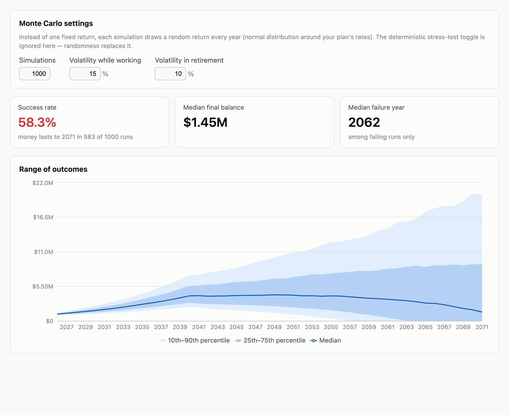

**Use it to answer:** "the Dashboard says we survive — but how fragile is that?" It re-runs the plan 1,000 times with randomized annual returns *averaging* your assumed rates. Even when the average return is fine, getting the bad years early (right after retiring, while withdrawals are large) can sink a plan that the Dashboard blesses — that's sequence-of-returns risk, and this page measures it. Rough reading: 90%+ success is solid; below 75% means the plan depends on luck.

### Backtest
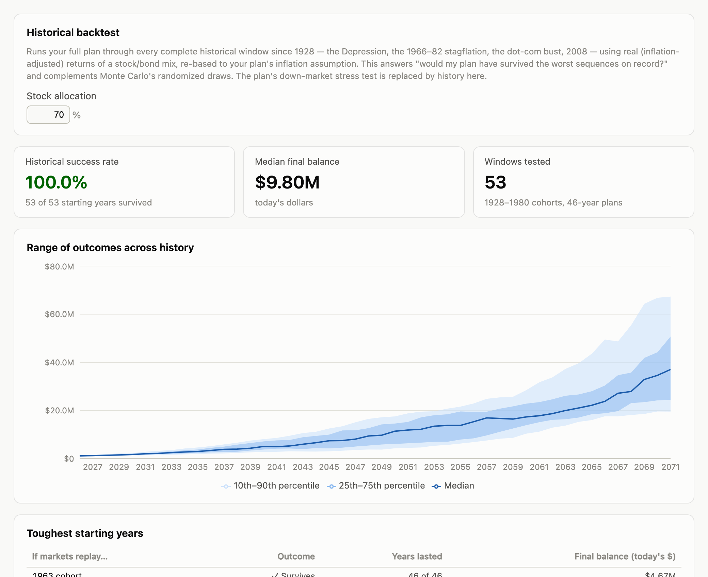

**Use it to answer:** "would this plan have survived the worst markets that actually happened?" It replays your full plan through every historical window since 1928 — retiring into the Depression, the 1966–82 stagflation, 2008 — at a stock/bond mix you choose. Monte Carlo asks "what if returns are randomly reordered?"; Backtest asks "what about the specific disasters on record?" They can disagree: history had crashes *and recoveries*, while Monte Carlo draws blindly. Trust a plan that passes both; investigate one that fails either.

### Scenarios
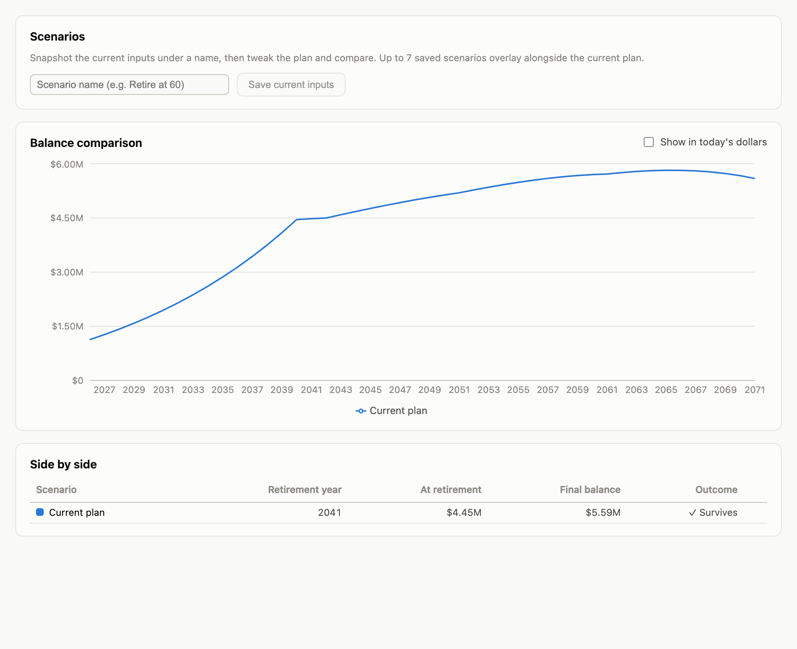

**Use it to compare whole plans side by side.** Snapshot the current inputs under a name ("Retire at 62", "No inheritance", "Plan as of Jan 2027"), change whatever you're curious about, snapshot again, and see every version's balance path on one chart. This is the "what if?" workbench — and the yearly-checkup tool (§6): compare this January's plan against last January's to see if you're tracking ahead or behind.

### Sensitivity
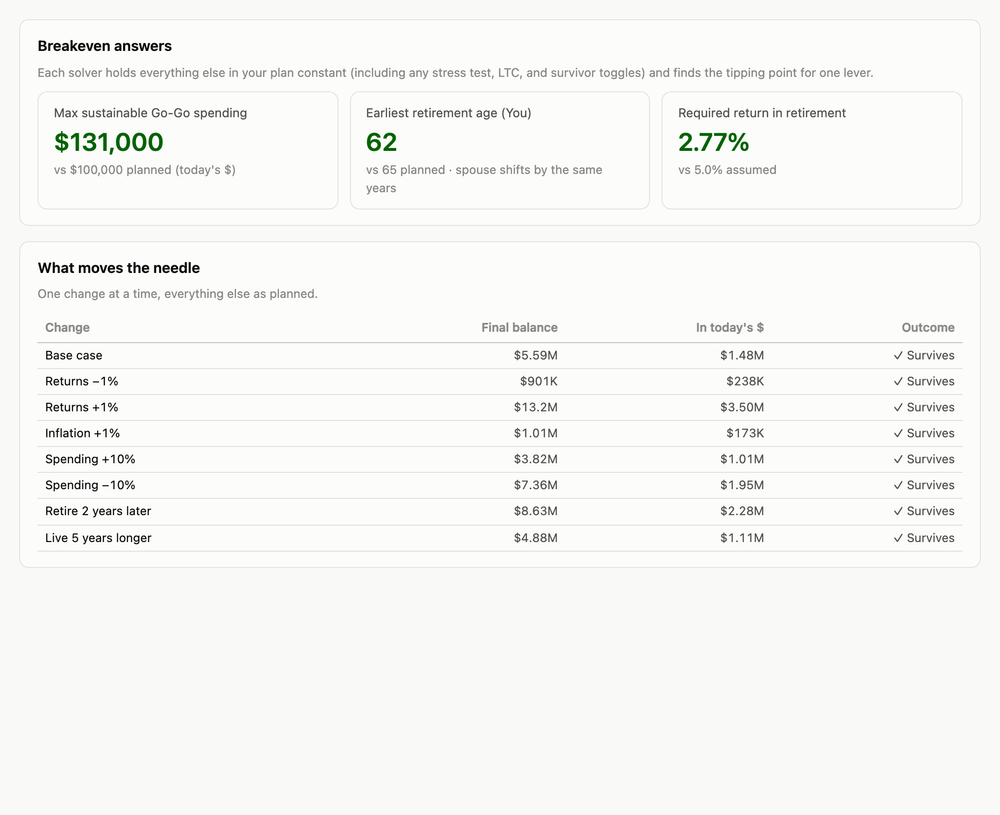

**Use it to find your limits and your levers.** The solvers answer "what's the *most* we could spend?", "what's the *earliest* we could retire?", and "what return does this plan actually require?" — breakeven numbers the Dashboard can't give you. The one-change-at-a-time table shows which assumption moves the outcome most, i.e., which inputs are worth agonizing over (usually spending and returns) and which barely matter.

### Strategies
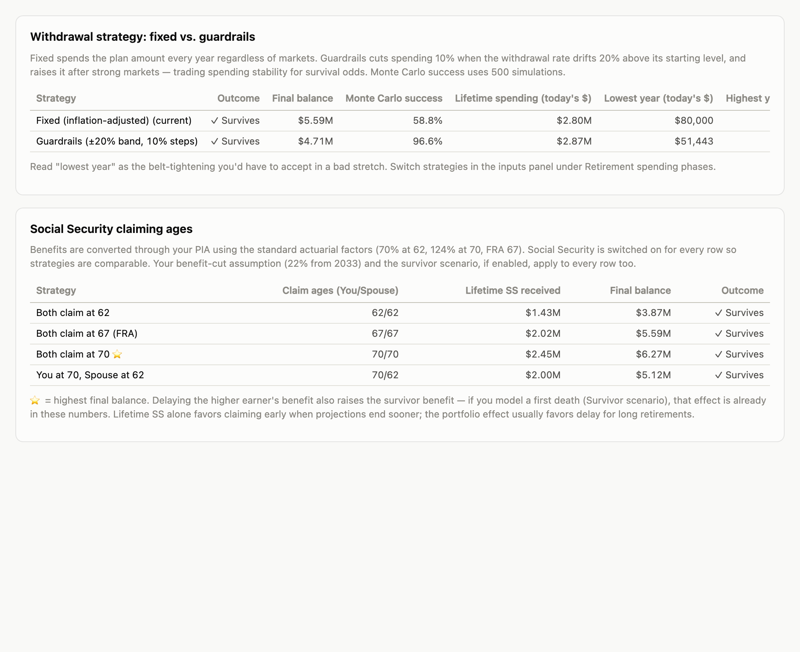

**Use it for the two biggest *behavioral* decisions** — choices about what you'll do, not what markets will do:

- *Fixed vs. guardrails withdrawals*: would you accept trimming spending ~10% during bad stretches in exchange for a much higher survival rate? The table quantifies exactly that trade — survival, Monte Carlo success, total lifetime spending, and the worst single year you'd have to live through.
- *Social Security claiming ages* (62 / 67 / 70 / split): includes the portfolio effect — delaying means drawing more from savings for a few years — not just total benefits, which is the mistake most rule-of-thumb advice makes.

### Roth Explorer *(detailed tax mode only)*
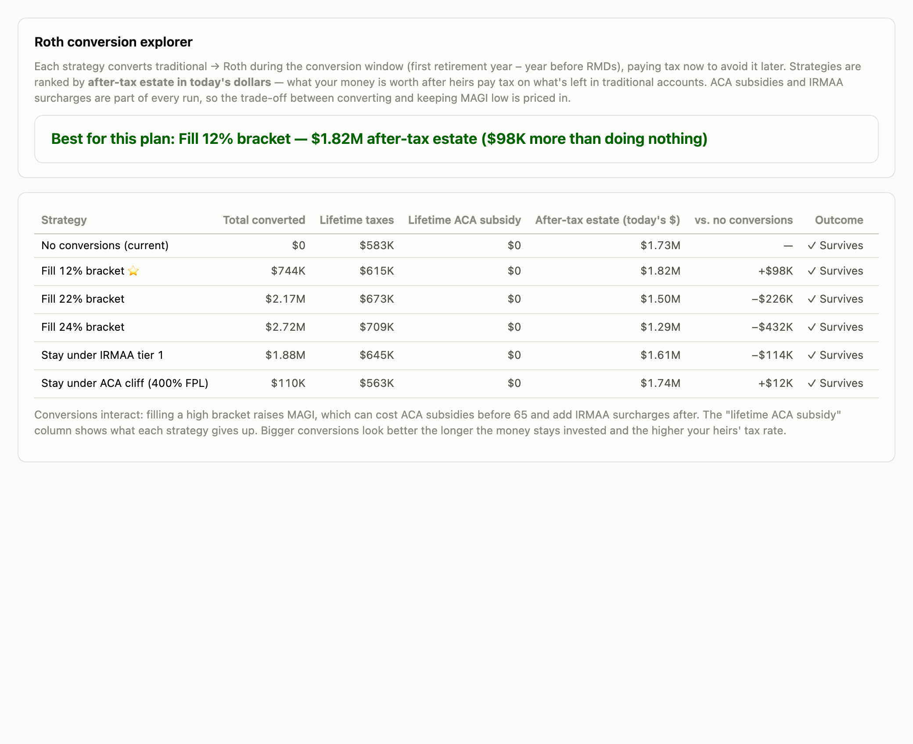

**Use it to decide whether paying taxes now beats paying them later.** Converting traditional-IRA money to Roth costs tax today but shrinks future RMDs and heirs' tax bills. The page compares strategies — none, fill the 12/22/24% bracket, stay under the first IRMAA tier, stay under the ACA cliff — by lifetime taxes, ACA subsidies given up, and what actually matters: after-tax estate in today's dollars. The ⭐ marks the winner; **Apply** adopts it into your plan. Get your account buckets and cost basis right first (§5) — this page is only as good as those numbers.

### Budget
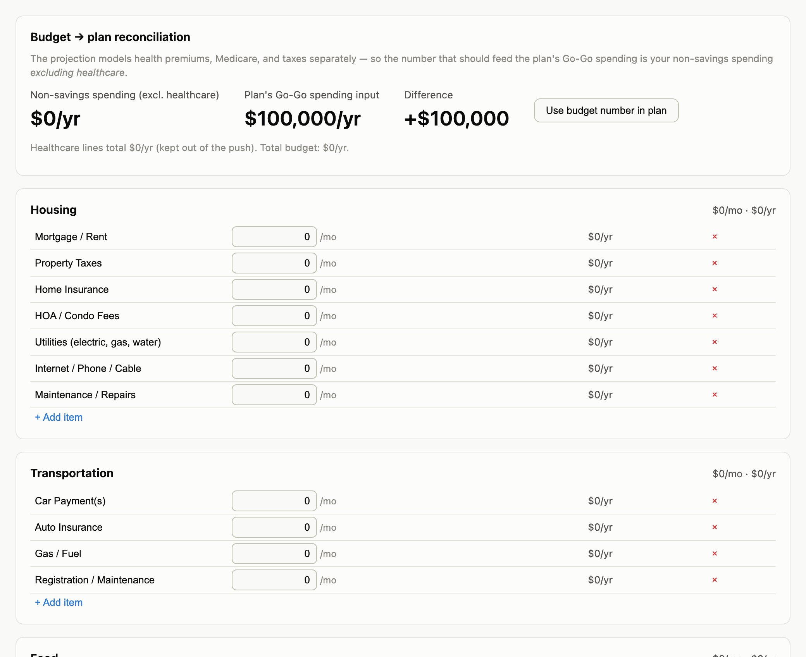

**Use it to keep the plan honest about spending** — the input everything else is most sensitive to. Track your real monthly budget, then *Push to plan* sends the non-savings, non-healthcare total into the plan's Go-Go spending (healthcare is excluded because the projection models premiums, Medicare, and taxes separately). A plan built on guessed spending is a guess.

## 5. Tax modes

**Simple** (the default) uses flat effective tax rates, exactly like the original Excel workbook. **Detailed** models real federal taxes: taxable / traditional / Roth account buckets with withdrawal ordering, 2026 brackets and capital-gains stacking, Social Security taxability, RMDs, Roth conversions, ACA subsidies from modeled income, and IRMAA. Switch under **Taxes → Tax model**.

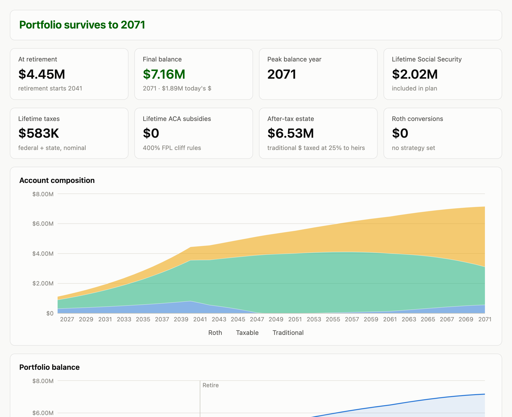

Detailed mode adds stats (lifetime taxes, ACA subsidies, after-tax estate) and the account-composition chart, and unlocks the Roth Explorer. Enter your real bucket balances and the taxable account's cost-basis percentage — the Roth and ACA results are only as good as that split.

## 6. Yearly update checklist (each January)

Work top to bottom; the order matters.

1. **Export a backup first.** Header → Export. File the JSON with your records.
2. **Snapshot the outgoing year.** Scenarios → save as "Plan as of Jan 2027" (etc.). This is what you'll compare against next year.
3. **Advance the plan one year.** In the inputs panel:
   - Start year → the new year; each person's current age → +1.
   - Current balance (or the three account buckets in detailed mode) → actual year-end values from your statements. Update the taxable basis % from your brokerage's cost-basis view.
   - Review spending against reality — the Budget tab helps if you track it there.
   - Medicare Part B/D premiums → the new year's announced amounts (once either of you is close to 65).
4. **Update the law and the data** — these live in code, so ask Claude Code:
   > Update the tax constants in src/model/tax/constants.ts to the new year's IRS numbers (brackets, standard deduction, LTCG thresholds, IRMAA tiers, FPL, ACA rules), append the latest year to src/model/data/history.ts, run the tests, and regenerate the user-guide screenshots.
5. **Re-run the checkup.** Dashboard verdict → Monte Carlo → Backtest → Strategies → Roth Explorer (if in detailed mode). Load last January's scenario on the Scenarios page and compare: is the plan tracking ahead or behind?
6. **Export again** so your backup reflects the updated plan.

Fifteen minutes for steps 1–3 and 5–6; step 4 is a short Claude session.

## 7. Regenerating this guide's screenshots

After UI changes or a yearly update, with the app running:

```bash
node docs/screenshots.mjs
```

It captures every page from the generic example plan (never real data) into `docs/img/`.
